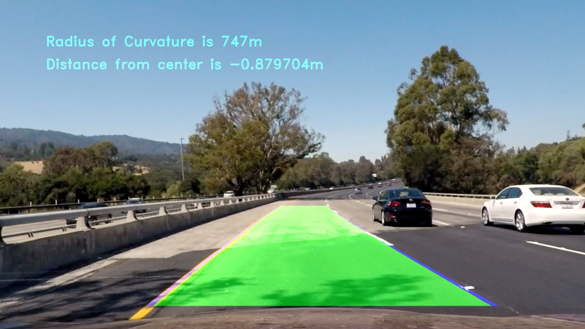

# **Advanced-Lane-Lines** 


## 1. Pipeline description

My pipeline consists of 9 steps:</br>

1. [Camera Calibration](#camera-calibration)</br>
2. [Distortion Correction](#distortion-correction)</br>
3. [Finding Lane Lines](#finding-lane-lines)</br>
4. [Gaussian blurring and Dilation](#gaussian-blurring-and-dilation)</br>
5. [Region of interest](#region-of-interest)</br>
6. [Perspective Transform](#perspective-transform)</br>
7. [Fitting Lane Lines](#fitting-lane-lines)</br>
8. [Radius of Curvature and Vehicle Position](#radius-of-curvature-and-vehicle-position)</br>
9. [Inverse Perspective Transform](#inverse-perspective-transform)</br>
</br>

---
Even before explaining the algorithm in detail, I would like to introduce few variables which control the workflow of my pipeline,
```
## Flags that control the algorithm
flagundistort=False
flagsavetemp=False
flagvideo=True
flagM=False
flagM1=False
```
* flagundistort - When Set to true, will undistort all images present in [Distorted Folder of Temp Directory](./Temp/Distorted)
* flagsavetemp  - When set to true, will save all images of [Finding Lane Lines](#finding-lane-lines)
* flagvideo     - When set to true, will run [Project Video](./test_videos/project_video.mp4) and when set to false, will Run all images
                  in [Test Image Directory](./test_images)
* flagM & flagM1 - These flags are internal ones, Used to improve performance of the pipeline.
---
### Camera Calibration

We can estimate the parameters of a lens and image sensor of an camera provided, image or video camera. These parameters can be used to correct for lens distortion such as tangential and spatial distortion.

OpenCV can be used to calibrate camera to find out the parameters for reducing the distortion. Typical way is using the chessboard image from different orientation and using OpenCV functions findChessboardCorners to findout camera matrix(mtx), distortion parameters(dist) for the reducing the distortion.

Once we find our camera parameters we can save them to a pickle file so we don't need to do this step every time we call our pipeline. It's important to note that this parameters are specific to each camera, so if you change your camera you would need to find new camera parameters.

```python

## Camera Calibration##
def findcampar(): 

    if len(glob.glob('Temp/CameraCalibration.p')):
        dist_mtx=pickle.load(open("Temp/CameraCalibration.p","rb"))
        mtx=dist_mtx[1]
        dist=dist_mtx[2]
    else:
        PIK='Temp/CameraCalibration.p'
        imgpoints=[]
        objpoints=[]
        objp=np.zeros((9*6,3),np.float32)
        objp[:,:2]=np.mgrid[0:9,0:6].T.reshape(-1,2)
        images=glob.glob('camera_cal/calibration*.jpg')
        for image in images:
            img=mpimg.imread(image)
            gray=cv2.cvtColor(img,cv2.COLOR_RGB2GRAY)
            ret, corners = cv2.findChessboardCorners(gray, (9,6), None)
            if ret== True:
                image=image.split('\\')
                imgpoints.append(corners)
                objpoints.append(objp)
                img=cv2.drawChessboardCorners(img,(9,6),corners,ret)
                cv2.imwrite('camera_cal/chessboard/'+image[1],img)
        ret, mtx, dist, rvecs, tvecs = cv2.calibrateCamera(objpoints, imgpoints, gray.shape[::-1], None, None) 
        with open(PIK, "wb") as f:
            data=[ret, mtx, dist, rvecs, tvecs]
            pickle.dump(data, f)
            
    return mtx,dist
```

More detailed information about camera calibration can be found at this [link](http://opencv-python-tutroals.readthedocs.io/en/latest/py_tutorials/py_calib3d/py_calibration/py_calibration.html).

---

### Distortion Correction

mtx, dist parameters from Camera Calibration is used to undistort the image using undistort function in Opencv.

* Distorted Image:
 

* Undsitorted Image:


if flagundistort is set to true, will undistort all images present in [Distorted Folder of Temp Directory](./Temp/Distorted) and save the undistorted images to [Undistorted Folder of Temp Directory](./Temp/Undistorted).

```python
if flagundistort:
    undistortimg()
  
def undistortimg():
    
    images=glob.glob('Temp/Distorted/*.jpg')
    if len(images)>0:
        f,ax=plt.subplots(len(images),2)
        f.tight_layout()
        for i,image in enumerate(images):
            img=mpimg.imread(image)
            image=image.split('\\')
            undimg=cv2.undistort(img, mtx, dist, None, mtx)
            cv2.imwrite('Temp/Undistorted/Undistorted_'+image[1],undimg)       
            ax[i][0].imshow(img)
            ax[i][0].set_title('Original Image', fontsize=20)
            ax[i][1].imshow(undimg)
            ax[i][1].set_title('Undistorted Image', fontsize=20)
```

For undistorting Images/Videos of Project we use,

```python
def undistort(img,mtx,dist):
    
    undimg=cv2.undistort(img, mtx, dist, None, mtx)
    return undimg
```
---
### Finding Lane Lines

I have used various combination of color and gradient thresholds to generate a binary image where the lane lines are clearly visible.. I have used gradient on x and y direction, manginutude of the gradient, direction of the gradient, and color transformation technique to get the final binary image.

In our pipeline we call the function color_mag_thresh to obtain the binary thresholded image.
```python
combined=color_mag_dir_thresh(img)
```
The color_mag_dir_thresh function uses varied techniques such as sobel thresholding, magnitude thresholding, directional thresholding and also picking up desired color such as yellow and white from different color spaces like RGB,HSV and HSL.
```python
def color_mag_dir_thresh(img): 
    
    gray=cv2.cvtColor(img,cv2.COLOR_BGR2GRAY)
    gradx=abs_sobel_thresh(gray,'x',3,(40,160))
    grady=abs_sobel_thresh(gray,'y',3,(40,160))
    mag_binary=mag_thresh(gray,3,(80,180))
    dir_binary = dir_threshold(gray, sobel_kernel=3, thresh=(0, np.pi/2))
    hls_binary=hls_select(img,(150,240))
    color=hsv(img)
    combined = np.zeros_like(color)
    combined[((gradx == 1) & (grady == 1)) | (color==1)| (( mag_binary==1) &  ( dir_binary==1)) |( hls_binary==1) ]=1
    if flagsavetemp:
        save_img(gradx,grady,combined,hls_binary,dir_binary,mag_binary,color)

    return combined
```

```python
def abs_sobel_thresh(img, orient='x', sobel_kernel=3, thresh=(0, 255)):
   
    if orient=='x':
        sobel_thresh=cv2.Sobel(img,cv2.CV_64F,1,0,sobel_kernel)      
    else:
        sobel_thresh=cv2.Sobel(img,cv2.CV_64F,0,1,sobel_kernel)
    abs_sobel=np.absolute(sobel_thresh)
    scaled_sobel=np.uint8(255*abs_sobel/np.max(abs_sobel))
    grad_binary=np.zeros_like(scaled_sobel)
    grad_binary[(scaled_sobel>=thresh[0])&(scaled_sobel<=thresh[1])]=1
    return grad_binary

def mag_thresh(img, sobel_kernel=3, mag_thresh=(0, 255)):
    
    sobelx=cv2.Sobel(img,cv2.CV_64F,1,0,sobel_kernel)  
    sobely=cv2.Sobel(img,cv2.CV_64F,0,1,sobel_kernel)
    abs_sobel=np.sqrt((sobelx**2)+(sobely**2))
    scalefactor=np.max(abs_sobel)/255
    abs_sobel=(abs_sobel/scalefactor).astype(np.uint8)
    mag_binary=np.zeros_like(abs_sobel)
    mag_binary[(abs_sobel>=mag_thresh[0])&(abs_sobel<=mag_thresh[1])]=1
    return mag_binary

def dir_threshold(img, sobel_kernel=3, thresh=(0, np.pi/2)):
    
    sobelx=cv2.Sobel(img,cv2.CV_64F,1,0,sobel_kernel)  
    sobely=cv2.Sobel(img,cv2.CV_64F,0,1,sobel_kernel)
    abs_sobelx=np.absolute(sobelx)
    abs_sobely=np.absolute(sobely)
    dir_sobel=np.arctan(abs_sobely/abs_sobelx)
    dir_binary=np.zeros_like(dir_sobel)
    dir_binary[(dir_sobel>=thresh[0])&(dir_sobel<=thresh[1])]=1
    return dir_binary
   
def hls_select(img, thresh=(0, 255)):
    
    imgs=cv2.cvtColor(img,cv2.COLOR_BGR2HLS)
    s=imgs[:,:,2]
    hls_binary=np.zeros_like(s)
    hls_binary[(s>thresh[0])&(s<=thresh[1])]=1  
    return hls_binary
    
def hsv(img):
    
    img1 = cv2.cvtColor(img, cv2.COLOR_BGR2HSV)
    yellow1 = np.array([ 0,120, 120], dtype=np.uint8)
    yellow2 = np.array([ 100,255, 255,], dtype=np.uint8)
    yellow = cv2.inRange(img, yellow1, yellow2)
    white1 = np.array([0, 0, 200], dtype=np.uint8)
    white2 = np.array([255, 30, 255], dtype=np.uint8)
    white = cv2.inRange(img1, white1, white2)
    out=cv2.bitwise_and(img, img, mask=(yellow | white))
    out=cv2.cvtColor(out,cv2.COLOR_BGR2GRAY)
    im_bw = cv2.threshold(out, 0, 255, cv2.THRESH_BINARY)[1]
    return im_bw/255

def save_img(gradx,grady,combined,hls_binary,dir_binary,mag_binary,color):
    
    cv2.imwrite('Temp/Sobelx'+'.jpg',gradx*255)
    cv2.imwrite('Temp/Sobely'+'.jpg',grady*255)
    cv2.imwrite('Temp/combined'+'.jpg',combined*255)
    cv2.imwrite('Temp/hls_binary'+'.jpg',hls_binary*255)
    cv2.imwrite('Temp/dir_binary'+'.jpg',dir_binary*255)
    cv2.imwrite('Temp/mag_binary'+'.jpg',mag_binary*255) 
    cv2.imwrite('Temp/color'+'.jpg',color*255)
    
```
---
### Gaussian blurring and Dilation

* To supress noise and spurious gradients Gaussian smoothing is applied.kernel of size 3 was chosen. Here, it's again preparation for edge detection step. 

```python
def gaussian_blur(img, kernel_size):
   
    return cv2.GaussianBlur(img, (kernel_size, kernel_size), 0)
```    
```python
combined=gaussian_blur(combined,3)
```
* increases the white region in the image or size of foreground object increases. Normally, in cases like noise removal, erosion is followed by dilation. Because, erosion removes white noises, but it also shrinks our object. So we dilate it. Since noise is gone, they won’t come back, but our object area increases. It is also useful in joining broken parts of an object. 

```python
ombined=cv2.dilate(combined,kernel,iterations = 1)
```
---
### Region of interest

To filter out unnecessary objects in the image, the region of interest is defined. Such mask (here it's trapezoid) is then applied to the working image.

```python
def region_of_interest(img, vertices):
    mask = np.zeros_like(img)     
    cv2.fillPoly(mask, vertices, 255)
    masked_image = cv2.bitwise_and(img, mask)
    return masked_image
```
---
### Perspective Transform

A perspective transform maps the points in a given image to different, desired, image points with a new perspective. The perspective transform you’ll be most interested in is a bird’s-eye view transform that let’s us view a lane from above; this will be useful for calculating the lane curvature.
Opencv provide two functions getPerspectiveTransform and warpPerspective to perform this task.

```python
def p_transform(img,H,W,LO,DO,M,flagM,src,dst):

    if not(flagM):
        src=np.float32([[W/2.28,H/1.6],[W/1.77,H/1.6],[W/1.2,H-LO],[W/5.73,H-LO]])
        dst=np.float32([[0+DO/2,0],[W-DO/2,0],[W-2*DO,H],[0+2*DO,H]])
        M = cv2.getPerspectiveTransform(src, dst)
        flagM=True
    warped = cv2.warpPerspective(img, M, (W,H), flags=cv2.INTER_LINEAR)
    return warped,M,src,dst,flagM
```
```python
warped,M,src,dst,flagM=p_transform(combined,H,W,LowerThres,DestThres,M,flagM,src,dst)
```
---
### Fitting Lane Lines

By fitting lane lines it details about the algorithm that was used to find the polynomial that fits the lane lines on the birdseye view image.

A more robust one that relies on histogram of image binaries to find X and Y points for each lane line and a "recursive" version that uses the line found on the previous frame as the baseline to where to look for lines in the current frame.

After applying calibration, thresholding, and a perspective transform to a road image, you should have a binary image where the lane lines stand out clearly. However, you still need to decide explicitly which pixels are part of the lines and which belong to the left line and which belong to the right line.I first take a histogram along all the columns in the lower half of the image.

With this histogram I am adding up the pixel values along each column in the image. In my thresholded binary image, pixels are either 0 or 1, so the two most prominent peaks in this histogram will be good indicators of the x-position of the base of the lane lines. I can use that as a starting point for where to search for the lines. From that point, I can use a sliding window, placed around the line centers, to find and follow the lines up to the top of the frame.
```python
def find_lanes_window(warped):
    
    histogram = np.sum(warped[warped.shape[0]//2:,:], axis=0)
    midpoint = np.int(histogram.shape[0]//2)
    leftx_base = np.argmax(histogram[:midpoint])
    rightx_base = np.argmax(histogram[midpoint:]) + midpoint
    window_height = np.int(warped.shape[0]//nwindows)
    nonzero = warped.nonzero()
    nonzeroy = np.array(nonzero[0])
    nonzerox = np.array(nonzero[1])
    leftx_current = leftx_base
    rightx_current = rightx_base
    left_lane_inds=[]
    right_lane_inds=[]
    for window in range(nwindows):
        win_y_low=warped.shape[0]-(window+1)*window_height
        win_y_high=warped.shape[0]-window*window_height
        win_xleft_low=leftx_current-margin
        win_xleft_high=leftx_current+margin
        win_xright_low=rightx_current-margin
        win_xright_high=rightx_current+margin
        good_left_inds =((nonzeroy >= win_y_low) & (nonzeroy < win_y_high) & 
        (nonzerox >= win_xleft_low) &  (nonzerox <= win_xleft_high)).nonzero()[0]
        good_right_inds=((nonzeroy >= win_y_low)&(nonzeroy < win_y_high) &
                         (nonzerox>=win_xright_low)&(nonzerox<=win_xright_high)).nonzero()[0]
                         
        if len(good_left_inds)>minpix:
            leftx_current=np.int(np.mean(nonzerox[good_left_inds]))          
        if len(good_right_inds)>minpix:
            rightx_current=np.int(np.mean(nonzerox[good_right_inds]))
     
        left_lane_inds.append(good_left_inds) 
        right_lane_inds.append(good_right_inds)
        
    try:
        left_lane_inds = np.concatenate(left_lane_inds)
        right_lane_inds = np.concatenate(right_lane_inds)
    except ValueError:
        
        pass
    
    leftx=nonzerox[left_lane_inds]
    lefty=nonzeroy[left_lane_inds]
    rightx=nonzerox[right_lane_inds]
    righty=nonzeroy[right_lane_inds]
    left_fit = np.polyfit(lefty, leftx, 2)
    right_fit = np.polyfit(righty, rightx, 2)
    return leftx,lefty,rightx,righty,left_fit,right_fit
```

```
 if len(left_fit) and len(right_fit):
#        leftx,lefty,rightx,righty,left_fit,right_fit=find_lanes_search(warped,left_fit,right_fit)
        leftx,lefty,rightx,righty,left_fit,right_fit=find_lanes_window(warped)
    else:   
        leftx,lefty,rightx,righty,left_fit,right_fit=find_lanes_window(warped)
```
Ideally there is also another function find_lanes_search which helps in increasing the performance but at loss of accuracy. This function get the initial second order polynomial from find_lanes_window function and try to search for the upcoming polynomial within the defined margin of pixels. To see the results of both probably you can comment line number 205 and uncomment line 204 in [Python Script](.Advanced%20Lane%20Lines.py). The function find_lane_search needs to be tuned and help on them would be appreciated. The code for find_lanes_search goes as follows,

```python
def find_lanes_search(warped,left_fit,right_fit):
    margin = 50
    nonzero = warped.nonzero()
    nonzeroy = np.array(nonzero[0])
    nonzerox = np.array(nonzero[1])

    left_lane_inds = ((nonzerox > (left_fit[0]*(nonzeroy**2) + left_fit[1]*nonzeroy + 
                    left_fit[2] - margin)) & (nonzerox < (left_fit[0]*(nonzeroy**2) + 
                    left_fit[1]*nonzeroy + left_fit[2] + margin)))
    right_lane_inds = ((nonzerox > (right_fit[0]*(nonzeroy**2) + right_fit[1]*nonzeroy + 
                    right_fit[2] - margin)) & (nonzerox < (right_fit[0]*(nonzeroy**2) + 
                    right_fit[1]*nonzeroy + right_fit[2] + margin)))
    
    leftx = nonzerox[left_lane_inds]
    lefty = nonzeroy[left_lane_inds] 
    rightx = nonzerox[right_lane_inds]
    righty = nonzeroy[right_lane_inds]
    left_fit = np.polyfit(lefty, leftx, 2)
    right_fit = np.polyfit(righty, rightx, 2)
    return leftx,lefty,rightx,righty,left_fit,right_fit
```

### Radius of Curvature and Vehicle Position

We say the curve and the circle have the same tangent and curvature at the point where they meet.The radius of curvature of the curve at a particular point is defined as the radius of the approximating circle. This radius changes as we move along the curve.

The position of car is found by finding the mid point of image and mid point of lane lines that found and to compare them.

```
curve,distance=CalculateRadiusOfCurvature(warped,left_fit,right_fit)
```
```python
def CalculateRadiusOfCurvature(binary_warped,left_fit,right_fit):
    
    ym_per_pix = 30/720 # meters per pixel in y dimension
    xm_per_pix = 3.7/700 # meters per pixel in x dimension
    
    ploty = np.linspace(0, binary_warped.shape[0]-1, binary_warped.shape[0] )
    leftx = left_fit[0]*ploty**2 + left_fit[1]*ploty +left_fit[2]
    rightx = right_fit[0]*ploty**2 + right_fit[1]*ploty + right_fit[2]
    positionCar= binary_warped.shape[1]/2
    left_fit_cr = np.polyfit(ploty*ym_per_pix, leftx*xm_per_pix, 2)
    right_fit_cr = np.polyfit(ploty*ym_per_pix, rightx*xm_per_pix, 2)    
    y_eval=np.max(ploty)
    left_curverad = ((1 + (2*left_fit_cr[0]*y_eval*ym_per_pix + left_fit_cr[1])**2)**1.5) / np.absolute(2*left_fit_cr[0])
    right_curverad = ((1 + (2*right_fit_cr[0]*y_eval*ym_per_pix + right_fit_cr[1])**2)**1.5) / np.absolute(2*right_fit_cr[0])   
    left_lane_bottom = (left_fit[0]*y_eval)**2 + left_fit[0]*y_eval + left_fit[2]
    right_lane_bottom = (right_fit[0]*y_eval)**2 + right_fit[0]*y_eval + right_fit[2]
    actualPosition= (left_lane_bottom+ right_laine_bottom)/2
    distance= (positionCar - actualPosition)* xm_per_pix
    return (left_curverad + right_curverad)/2, distance
```
---
### Inverse Perspective Transform

This is same as Perspective Transform , We must understand that we have did all our techniques of finding lanes and drawing them on Bird's eye transfromed image . In order to have the orginal image back we must inverse transform. This can be obtained by just switching source as destination points and vice versa.

```python
if not(flagM1):
        M1 = cv2.getPerspectiveTransform(dst, src)
        flagM1=True
    newwarp = cv2.warpPerspective(color_warp, M1, (warped.shape[1], warped.shape[0]))

```
The final output after all the steps in pipeline would look like this,



The video can be found at [Project Video](./output_videos/Annotated_project_video.mp4)

---

## 2. Potential shortcomings

Potential shortcoming of this algorithm is , 
1. The algorithm may jitter roads with sign marked in yellow or white as histogram and sliding window technique may not give a trusty result.
2. The algorithm might not work well for lanes that are too curvy with different illumination and glare .
3. The algorithm may fail in roads of high traffic or if any object occludes with lanes.

## 3. Possible improvements

Possible improvement would be,
1. To fix the above mentioned issues 1 and 2 we may have to work on hypertuning the histogram part as well as finding lane using color and thresholding.
2. We may have to move ahead to Machine learning technique to overcome issue 3 mentioned.

