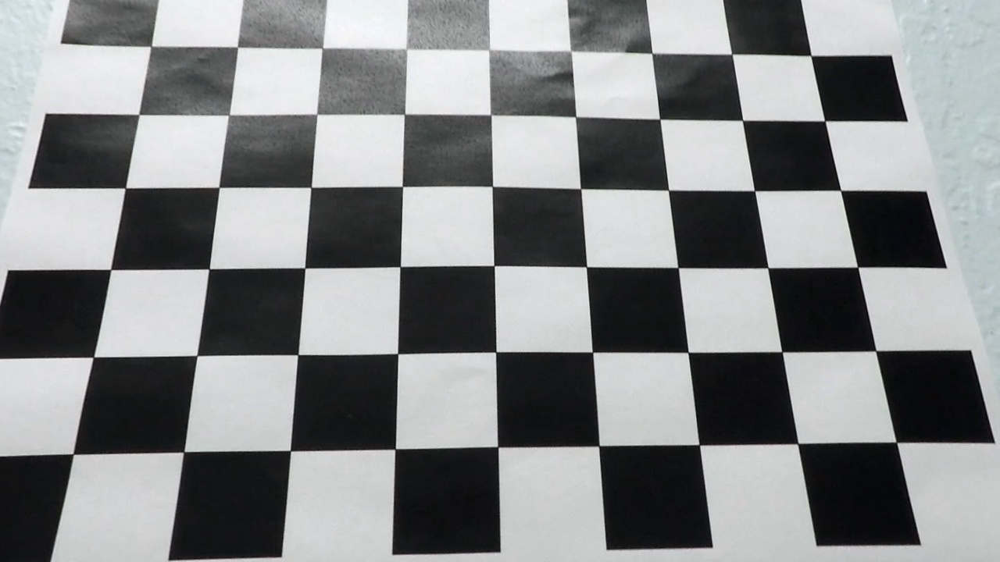

# **Advanced-Lane-Lines** 


## 1. Pipeline description

My pipeline consists of 9 steps:</br>

1. [Camera Calibration](#camera-calibration)</br>
2. [Distortion Correction](#distortion-correction)</br>
3. [Finding Lane Lines](#finding-lane-lines)</br>
4. [Gaussian blurring and Dilation](#gaussian-blurring-and-dilation)</br>
5. [Region of interest definition](#region-of-interest-definition)</br>
6. [Perspective Transform](#perspective-transform)</br>
7. [Fitting Lane Lines](#fitting-lane-lines)</br>
8. [Radius of Curvature and Vehicle Position](#radius-of-curvature-and-vehicle-position)</br>
9. [Inverse Perspective Transform](#inverse-perspective-transform)</br>
</br>


Even before explaining the algorithm in detail, I would like to introduce few variables which control the workflow of my pipeline,
```
## Flags that control the algorithm
flagundistort=False
flagsavetemp=False
flagvideo=True
flagM=False
flagM1=False
```
* flagundistort - When Set to true, will undistort all images present in [Distorted Folder of Temp Directory](./Temp/Distorted)
* flagsavetemp  - When set to true, will save all images of [Finding Lane Lines](#finding-lane-lines)
* flagvideo     - When set to true, will run [Project Video](./test_videos/project_video.mp4) and when set to false, will Run all images
                  in [Test Image Directory](./test_images)
* flagM & flagM1 - These flags are internal ones, Used to improve performance of the pipeline.

### Camera Calibration

We can estimate the parameters of a lens and image sensor of an camera provided, image or video camera. These parameters can be used to correct for lens distortion such as tangential and spatial distortion.

OpenCV can be used to calibrate camera to find out the parameters for reducing the distortion. Typical way is using the chessboard image from different orientation and using OpenCV functions findChessboardCorners to findout camera matrix(mtx), distortion parameters(dist) for the reducing the distortion.

Once we find our camera parameters we can save them to a pickle file so we don't need to do this step every time we call our pipeline. It's important to note that this parameters are specific to each camera, so if you change your camera you would need to find new camera parameters.

```python

## Camera Calibration##
def findcampar(): 

    if len(glob.glob('Temp/CameraCalibration.p')):
        dist_mtx=pickle.load(open("Temp/CameraCalibration.p","rb"))
        mtx=dist_mtx[1]
        dist=dist_mtx[2]
    else:
        PIK='Temp/CameraCalibration.p'
        imgpoints=[]
        objpoints=[]
        objp=np.zeros((9*6,3),np.float32)
        objp[:,:2]=np.mgrid[0:9,0:6].T.reshape(-1,2)
        images=glob.glob('camera_cal/calibration*.jpg')
        for image in images:
            img=mpimg.imread(image)
            gray=cv2.cvtColor(img,cv2.COLOR_RGB2GRAY)
            ret, corners = cv2.findChessboardCorners(gray, (9,6), None)
            if ret== True:
                image=image.split('\\')
                imgpoints.append(corners)
                objpoints.append(objp)
                img=cv2.drawChessboardCorners(img,(9,6),corners,ret)
                cv2.imwrite('camera_cal/chessboard/'+image[1],img)
        ret, mtx, dist, rvecs, tvecs = cv2.calibrateCamera(objpoints, imgpoints, gray.shape[::-1], None, None) 
        with open(PIK, "wb") as f:
            data=[ret, mtx, dist, rvecs, tvecs]
            pickle.dump(data, f)
            
    return mtx,dist
```

More detailed information about camera calibration can be found at this [link](http://opencv-python-tutroals.readthedocs.io/en/latest/py_tutorials/py_calib3d/py_calibration/py_calibration.html).

### Distortion Correction

mtx, dist parameters from Camera Calibration is used to undistort the image using undistort function in Opencv.

* Distorted Image:
 

* Undsitorted Image:


if flagundistort is set to true, will undistort all images present in [Distorted Folder of Temp Directory](./Temp/Distorted) and save the undistorted images to [Undistorted Folder of Temp Directory](./Temp/Undistorted).

```python
if flagundistort:
    undistortimg()
  
def undistortimg():
    
    images=glob.glob('Temp/Distorted/*.jpg')
    if len(images)>0:
        f,ax=plt.subplots(len(images),2)
        f.tight_layout()
        for i,image in enumerate(images):
            img=mpimg.imread(image)
            image=image.split('\\')
            undimg=cv2.undistort(img, mtx, dist, None, mtx)
            cv2.imwrite('Temp/Undistorted/Undistorted_'+image[1],undimg)       
            ax[i][0].imshow(img)
            ax[i][0].set_title('Original Image', fontsize=20)
            ax[i][1].imshow(undimg)
            ax[i][1].set_title('Undistorted Image', fontsize=20)
```

For undistorting Images/Videos of Project we use,

```python
def undistort(img,mtx,dist):
    
    undimg=cv2.undistort(img, mtx, dist, None, mtx)
    return undimg
```
### Finding Lane Lines
### Gaussian blurring and Dilation
* To supress noise and spurious gradients Gaussian smoothing is applied.kernel of size 3 was chosen. Here, it's again preparation for edge detection step. 

```python
def gaussian_blur(img, kernel_size):
   
    return cv2.GaussianBlur(img, (kernel_size, kernel_size), 0)
```    
```python
combined=gaussian_blur(combined,3)
```
* increases the white region in the image or size of foreground object increases. Normally, in cases like noise removal, erosion is followed by dilation. Because, erosion removes white noises, but it also shrinks our object. So we dilate it. Since noise is gone, they won’t come back, but our object area increases. It is also useful in joining broken parts of an object. 

```python
ombined=cv2.dilate(combined,kernel,iterations = 1)
```


### Region of interest definition
To filter out unnecessary objects in the image, the region of interest is defined. Such mask (here it's trapezoid) is then applied to the working image.

```python
def region_of_interest(img, vertices):
    mask = np.zeros_like(img)     
    cv2.fillPoly(mask, vertices, 255)
    masked_image = cv2.bitwise_and(img, mask)
    return masked_image
```

### Perspective Transform

A perspective transform maps the points in a given image to different, desired, image points with a new perspective. The perspective transform you’ll be most interested in is a bird’s-eye view transform that let’s us view a lane from above; this will be useful for calculating the lane curvature.
Opencv provide two functions getPerspectiveTransform and warpPerspective to perform this task.

```python
def p_transform(img,H,W,LO,DO,M,flagM,src,dst):

    if not(flagM):
        src=np.float32([[W/2.28,H/1.6],[W/1.77,H/1.6],[W/1.2,H-LO],[W/5.73,H-LO]])
        dst=np.float32([[0+DO/2,0],[W-DO/2,0],[W-2*DO,H],[0+2*DO,H]])
        M = cv2.getPerspectiveTransform(src, dst)
        flagM=True
    warped = cv2.warpPerspective(img, M, (W,H), flags=cv2.INTER_LINEAR)
    return warped,M,src,dst,flagM
```
```python
warped,M,src,dst,flagM=p_transform(combined,H,W,LowerThres,DestThres,M,flagM,src,dst)
```
### Fitting Lane Lines
### Radius of Curvature and Vehicle Position
### Inverse Perspective Transform

